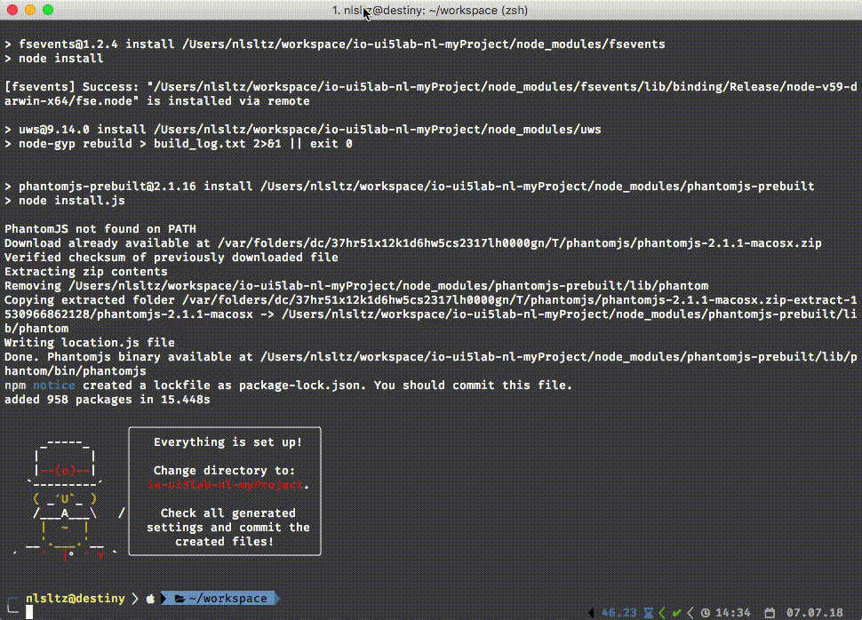

# UI5 Boilerplate Generator [![NPM version][npm-image]][npm-url] [![Build Status][travis-image]][travis-url] [![Dependency Status][daviddm-image]][daviddm-url]

> **Note:** 🚧 This generator is under heavy development. Use at your own risk! 🚧

> This generator is meant for use with Yeoman

### Contributions are very welcome! ✌️

## Installation

First, install [Yeoman](http://yeoman.io), [generator-ui5-boilerplate](https://www.npmjs.com/package/generator-ui5-boilerplate) and [UI5 CLI](https://github.com/SAP/ui5-tooling) using [npm](https://www.npmjs.com/) (we assume you have pre-installed [node.js](https://nodejs.org/)).

```bash
npm install -g yo
npm install -g generator-ui5-boilerplate
npm install -g @ui5/cli
```

Navigate to your workspace directory and then generate your new project. The generator will ask you a bunch of questions to build a comprehensive boilerplate project for you.

```bash
cd ~/workspace
yo ui5-boilerplate
```

After everything is set up navigate into the newly created project directory. You'll find a quick start guide in the project `README.md` file.

## TODO

 * ~~Add unit and integration tests for Simple App template~~
 * Add Master/Detail app template
 * Add Flexible Column Layout app template
 * Add Library template
 * Add sub generators for views/controllers
 * Add sub generator for control
 * Add option to read metadata file from provided OData-Service
   * and output entities etc.
   * save metadata.xml file for mockserver use
 * Add further tests for right file content
 * ~~Add select questions for docum~~entation purposes (All SAP Roles, ...)
 * Split app templates in base files and layout specific changes/additions (kill redundancy)

 ---

Here is a sample output of `tree` command for a generated simple-app project.

```
project-folder
├── webapp
│   ├── controller
│   │   ├── App.controller.js
│   │   └── BaseController.js
│   ├── css
│   │   └── style.css
│   ├── i18n
│   │   └── i18n.properties
│   ├── localService
│   │   ├── mockdata
│   │   │   ├── CarrierCollection.json
│   │   │   └── FlightCollection.json
│   │   ├── metadata.xml
│   │   └── mockserver.js
│   ├── model
│   │   ├── formatter.js
│   │   └── models.js
│   ├── test
│   │   ├── integration
│   │   │   ├── pages
│   │   │   │   ├── App.js
│   │   │   │   └── Common.js
│   │   │   ├── AllJourneys.js
│   │   │   ├── AppJourney.js
│   │   │   └── opaTests.qunit.html
│   │   ├── unit
│   │   │   ├── controller
│   │   │   │   └── BaseController.js
│   │   │   ├── allTests.js
│   │   │   └── unitTests.qunit.html
│   │   └── testsuite.qunit.html
│   ├── view
│   │   ├── dialogs
│   │   │   └── .gitkeep
│   │   ├── fragments
│   │   │   └── .gitkeep
│   │   └── App.view.xml
│   ├── Component.js
│   ├── flpSandbox.html
│   ├── flpSandboxMockServer.html
│   ├── index.html
│   └── manifest.json
├── .editorconfig
├── .eslintignore
├── .eslintrc
├── .gitignore
├── .npmrc
├── .travis.yml
├── LICENSE
├── README.md
├── karma-ci.conf.js
├── karma.conf.js
├── neo-app.json
├── package-lock.json
├── package.json
└── ui5.yaml

15 directories, 41 files
```

## Getting To Know Yeoman

 * Yeoman has a heart of gold.
 * Yeoman is a person with feelings and opinions, but is very easy to work with.
 * Yeoman can be too opinionated at times but is easily convinced not to be.
 * Feel free to [learn more about Yeoman](http://yeoman.io/).

## License

MIT © [Nils Lutz](http://bit.ly/2zl4DQn)

## GIFs
> Because we all love GIFs 🖖

### Prerequisites  


### Generator in use


### Test the result


[npm-image]: https://badge.fury.io/js/generator-ui5-boilerplate.svg
[npm-url]: https://npmjs.org/package/generator-ui5-boilerplate
[travis-image]: https://travis-ci.org/nlsltz/generator-ui5-boilerplate.svg?branch=master
[travis-url]: https://travis-ci.org/nlsltz/generator-ui5-boilerplate
[daviddm-image]: https://david-dm.org/nlsltz/generator-ui5-boilerplate.svg?theme=shields.io
[daviddm-url]: https://david-dm.org/nlsltz/generator-ui5-boilerplate
